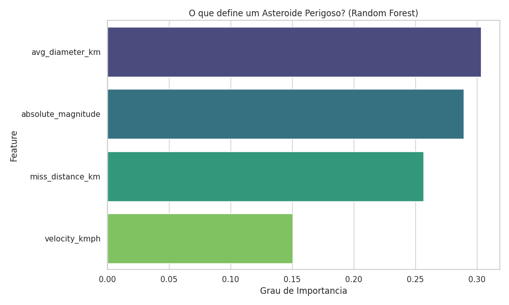
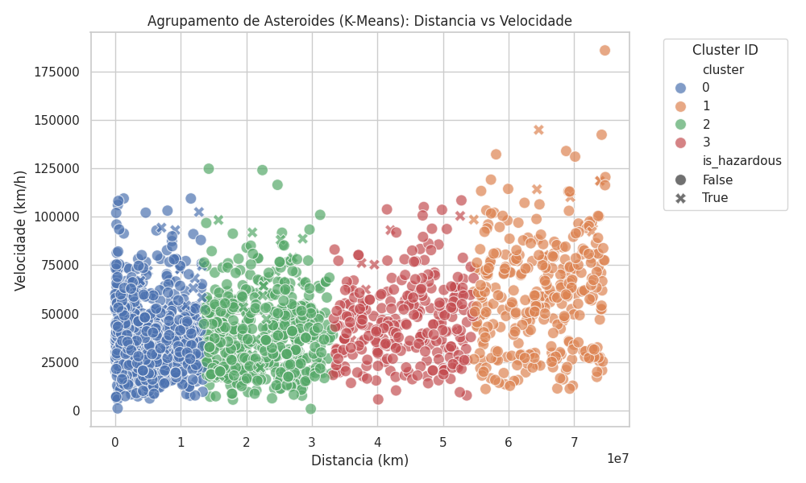
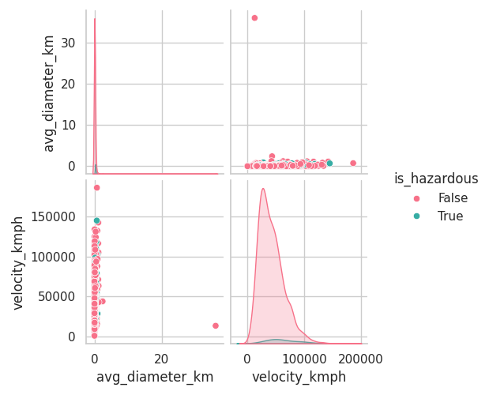

# NASA Asteroid Data Pipeline


## Project Overview

This project implements an end-to-end data engineering pipeline designed to ingest, process, and analyze Near-Earth Objects (NEOs) data from the NASA NeoWs API.

The system is built on a Medallion Architecture (Bronze, Silver, Gold layers) using Google Cloud Platform resources. It features an automated MLOps workflow that trains Random Forest and K-Means models to classify hazardous asteroids and identify orbital clusters, generating static analytical dashboards for stakeholders.

## Architecture

The pipeline is orchestrated by Apache Airflow and containerized using Docker. The data flow follows the ELT (Extract, Load, Transform) paradigm.

| Layer | Component | Description |
| :--- | :--- | :--- |
| **Ingestion (Bronze)** | Python / Requests | Fetches daily JSON data from NASA API and stores raw files in Google Cloud Storage (GCS) with idempotency checks. |
| **Processing (Silver)** | Apache Spark | Uses PySpark to read raw JSON, normalize nested structures (arrays), enforce schema, and write clean parquet/avro data. |
| **Warehousing (Gold)** | BigQuery | Stores the final analytical table, partitioned by observation date and clustered by hazard status. |
| **Machine Learning** | Scikit-Learn | Trains supervised (Random Forest) and unsupervised (K-Means) models to predict risk and group objects. |
| **Visualization** | Seaborn / Matplotlib | Generates statistical plots and uploads them to the Data Lake for reporting. |

## Data Analysis & Results

The pipeline includes a reporting module that generates visualizations based on the trained models.

### 1. Feature Importance (Random Forest)
Analysis of which physical characteristics most significantly influence the "Potentially Hazardous" classification. The model identifies "Average Diameter" as the primary determinant factor.



### 2. Asteroid Clustering (K-Means)
Unsupervised grouping of asteroids based on miss distance and velocity. The visualization reveals distinct clusters primarily driven by proximity to Earth.



### 3. Statistical Overview
Correlation analysis between velocity, diameter, and hazard status.



## Getting Started

### Prerequisites
* Docker Desktop & Astro CLI
* Google Cloud Platform Account (GCS & BigQuery API enabled)
* NASA API Key

### Installation

1. Clone the repository:
   ```bash
   git clone [https://github.com/dev-marcvs/nasa-asteroid-pipeline.git](https://github.com/dev-marcvs/nasa-asteroid-pipeline.git)
   cd nasa-asteroid-pipeline
   ```

2. Configure Credentials:
   * Place the GCP Service Account key in `include/gcp/service_account.json`.
   * Update the `API_KEY` variable in `include/ingest_nasa_asteroid.py`.

3. Initialize the Environment:
   ```bash
   astro dev start
   ```

4. Access the Airflow UI:
   Navigate to `http://localhost:8080` and enable the DAGs.

## Project Structure

```text
.
├── dags/
│   ├── nasa_asteroid_ingestion_dag.py  # Main ETL Pipeline
│   ├── nasa_ml_training_dag.py         # MLOps Pipeline
│   └── nasa_analytics_dag.py           # Reporting Pipeline
├── include/
│   ├── ingest_nasa_asteroid.py         # API Extraction Script
│   ├── process_nasa_asteroid.py        # Spark Transformation Job
│   ├── train_asteroid_model.py         # ML Model Training
│   └── generate_dashboard.py           # Visualization Script
├── assets/                             # Documentation Images
├── Dockerfile
├── packages.txt                        # OS Dependencies
└── requirements.txt                    # Python Dependencies
```

## Contact

Project developed by Marcus Vinícius Gianesini Ferreira.

https://www.linkedin.com/in/marcus-vinicius-gianesini-ferreira